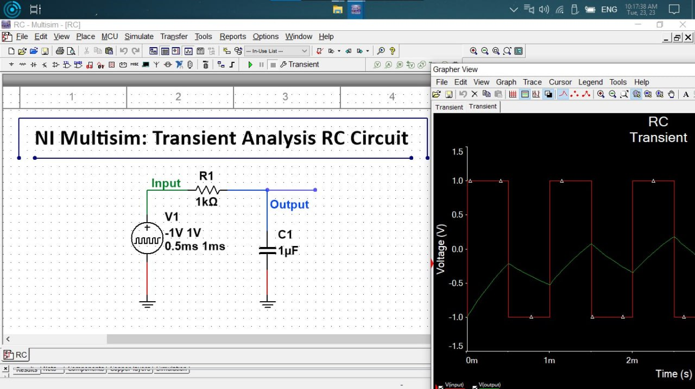
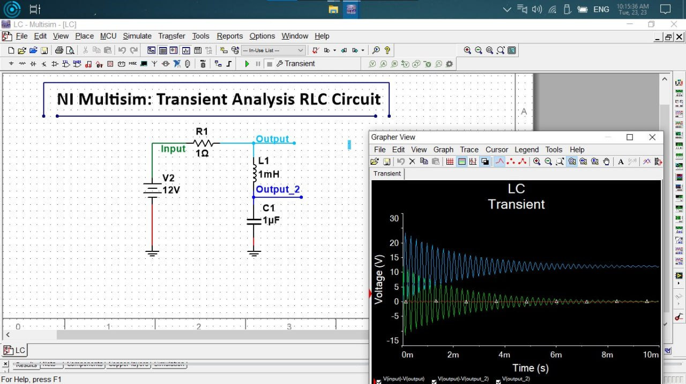
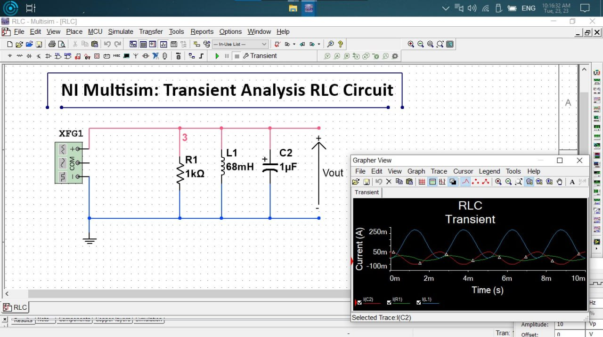

## مقدمة

عندما يرن هاتفك، أو يلتقط الراوتر إشارة Wi-Fi، أو تتخذ وحدة التحكم في السيارة قرارا خلال أجزاء من الثانية، فهناك ظاهرة خفية تعمل في الخلفية: **استجابة الدارات الكهربائية للتغير المفاجئ في الإشارة**.
هذه الاستجابة هي ما يحدد سرعة النظام، دقته، واستقراره، وهي ما يفصل بين جهاز موثوق وآخر متذبذب أو بطيء.

ورغم تعقيد الإلكترونيات الحديثة، فإن جوهر هذه الظاهرة يمكن شرحه عبر ثلاث دارات فقط:
**RC وRLC بالتوالي وRLC بالتوازي.**

هذه الدارات هي النماذج التي تبنى عليها مرشحات الإشارات، دوائر الاتصالات، محولات الطاقة، أنظمة التحكم والاستشعار. إن فهم استجابتها الزمنية هو الخطوة الأولى لفهم كيف تتفاعل الإلكترونات مع الزمن وكيف تتشكل الموجات داخل أي جهاز نستخدمه يوميا.

---

# أولا: دارة RC Series — مدرسة الشحن والتفريغ

## الفكرة الأساسية

دارة RC هي أبسط نموذج يفهم من خلاله المهندس كيف تستجيب الدارة لأي إشارة متغيرة.
يمثل ثابت الزمن $$ \tau = RC $$ مؤشرا مباشرا لمدى سرعة الدارة في التفاعل مع الإشارة.

- إشارة الدخل مربعة (تغير لحظي).
- إشارة الخرج منحنية بسبب شحن وتفريغ المكثف.
- السلوك يمثل **مرشح تمرير منخفض (Low Pass Filter)**.

### الاستخدامات الواقعية

- تنعيم خرجة محولات DC
- إزالة التشويش من الإشارات
- دوائر التأخير الزمنية

---

# ثانيا: دارة RLC Series — التذبذب المتناقص

## الفكرة الأساسية

بوجود المكثف والملف، تبدأ الدارة بتبادل الطاقة الكهربائية والمغناطيسية. لكن وجود المقاومة يجعل التذبذب يتناقص تدريجيا. تردد الرنين للدارة هو:

TODO: FIX EQUATIONS IN WHOLE FILE ! ITS SHOWING AS STRING IIN WEBSITE "$$ f_0 = \frac{1}{2\pi\sqrt{LC}} $$" 

$$ f_0 = \frac{1}{2\pi\sqrt{LC}} $$

- تذبذب جيبي يبدأ كبيرا ثم يتلاشى.
- التيار والجهد يتأرجحان حول نقطة التوازن.
- الاستقرار يتحقق تدريجيا بسبب المقاومة.

### الاستخدامات الواقعية

- مرشحات التردد الانتقائية
- أجهزة الاستقبال الراديوية
- تحليل استقرار الأنظمة

---

# ثالثا: دارة RLC Parallel — التذبذب شبه الحر

## الفكرة الأساسية

توصيل العناصر على التوازي يقلل من تأثير المقاومة، مما يتيح تذبذبا أقوى وأطول عمرا:

- طاقة أكبر تتبادل بين L وC
- تردد واضح ومستقر
- تلاشي بطيء جدا للاستجابة

- الذبذبة أعلى سعة من دارة التوالي.
- الشكل الموجي أكثر نقاء.
- التخميد ضعيف جدا.

### الاستخدامات الواقعية

هذه الدارة بالذات هي قلب:

- الهوائيات
- مرنانات الاتصالات (RF Resonators)
- دوائر تضخيم التردد
- RFID وNFC

---

# مقارنة

| الدارة | السلوك | التطبيقات |
|---|---|---|
| **RC Series** | شحن/تفريغ أسي | الفلاتر، التحكم، تحويل القدرة |
| **RLC Series** | تذبذب متناقص | الاتصالات، التحليل، المرشحات |
| **RLC Parallel** | تذبذب شبه حر | الهوائيات، RF، أنظمة الرنين |

---

# الخلاصة

هذه الدارات الثلاث هي الأساس لفهم كيف تتذبذب الإشارة، وكيف تستقر الدارة، وكيف تتصرف الأنظمة عند أي تغيير مفاجئ. باستخدام أدوات المحاكاة مثل **NI Multisim** يمكن رؤية هذه الظواهر بوضوح، وفهم الطريقة التي تبنى بها كل التقنيات الحديثة.

# للاجتهاد

أفضل طريقة لفهم والتعمق هو الأستكشاف بالتجربة، لذلك قم بمحاولة فهم وتحليل دارة RL Series وانظر ماذا تعطي؟ كيف تستجيب لإشارة الدخل ؟ ماذا تعطينا خرج ؟ كيف يمكن الاستفادة منها واين تستخدم ؟.
شاركوني بارائكم