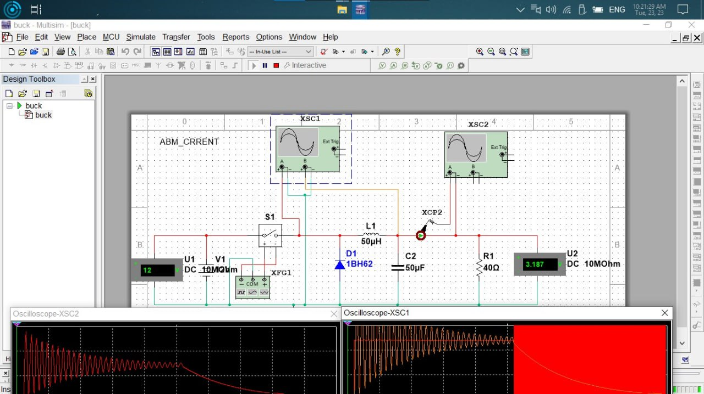
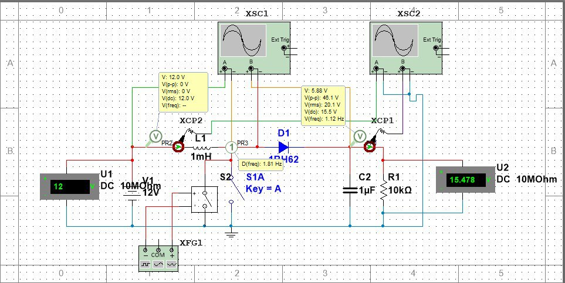

## Introduction

**DC-DC Converters** are among the most fundamental building blocks in modern electronics. Whether you are working on a robot, a control board, a battery charger, or any electrical project, you will often need to either step down (Buck) or step up (Boost) a voltage.

In this article, we will explore two basic circuits used in almost all power systems, explaining their mechanism, design laws, and practical simulation results.

---

# First: The Buck Converter (Step-Down)

## How a Buck Converter Works

A Buck converter steps down the input voltage to a lower output voltage while maintaining high efficiency. The essential components are:

- An electronic switch S1
- An inductor L
- A diode D1
- A capacitor C2
- A load resistor R1

### Mechanism of Action

#### 1. **When S1 is ON**
- The input voltage is directly applied to the inductor.
- The inductor current increases according to the relation: $v_L = L \frac{di}{dt}$
- Energy is stored in a magnetic field within the inductor.

#### 2. **When S1 is OFF**
- The voltage across the inductor suddenly drops.
- The inductor maintains current continuity through the diode D1.
- The energy is discharged into the load and the capacitor.

**Result:** The output voltage is lower than the input voltage.

---

## Basic Mathematical Relationship

The output voltage is determined by: $$ V_{out} = D \cdot V_{in} $$

Where D = Duty Cycle = the proportion of time the switch is ON.

**Example:** For D = 0.4 and Vin = 12V, we get $$ V_{out} = 0.4 \times 12 = 4.8\; \text{V} $$

---

## Waveform Analysis

The curve shows the natural behavior of LC circuits:

- Initial transient response
- Fluctuation of the inductor current during ON/OFF states
- Voltage stabilization over time

---

# Second: The Boost Converter (Step-Up)

## How a Boost Converter Works

A Boost converter steps up the voltage from a lower value to a higher one. The essential components are:

- A switch S2
- An inductor L1
- A diode D1
- An output capacitor C2
- A load resistor R1

---

## Mechanism of Action

#### 1. **When S2 is ON**
- The inductor is connected to the input voltage only.
- The inductor current increases, and the magnetic field is stored.

#### 2. **When S2 is OFF**
- The inductor tries to maintain the current.
- The voltage rises rapidly across the diode.
- The capacitor is charged to a voltage higher than Vin.

---

## Basic Mathematical Relationship

The output voltage follows the relation: $$ V_{out} = \frac{V_{in}}{1-D} $$

**Example from the simulation:** With D = 0.2 and Vin = 12V, we calculate $$ V_{out} = \frac{12}{1-0.2} = 15\; \text{V} $$

This is very close to the measured value: **15.478V**.

---

## Waveform Analysis

The curve shows:

- A gradual increase in voltage
- The output stabilizes at ~15.4V
- A time response that depends on the L and C values

---

# Quick Comparison

| Circuit | Function | Basic Relationship |
|---|---|---|
| **Buck** | Steps down voltage | $V_{out} = D \cdot V_{in}$ |
| **Boost**| Steps up voltage | $V_{out} = \frac{V_{in}}{1-D}$ |

---

# Conclusion

The **Buck** and **Boost** circuits are the foundation of voltage converters in all modern electronics. Understanding them is essential for any engineer working in fields such as:

- Robotics
- Solar power systems
- Battery chargers
- Microcontroller units
- Portable systems

**Multisim** software allows you to simulate these circuits and verify the correct values before implementing them in reality.
