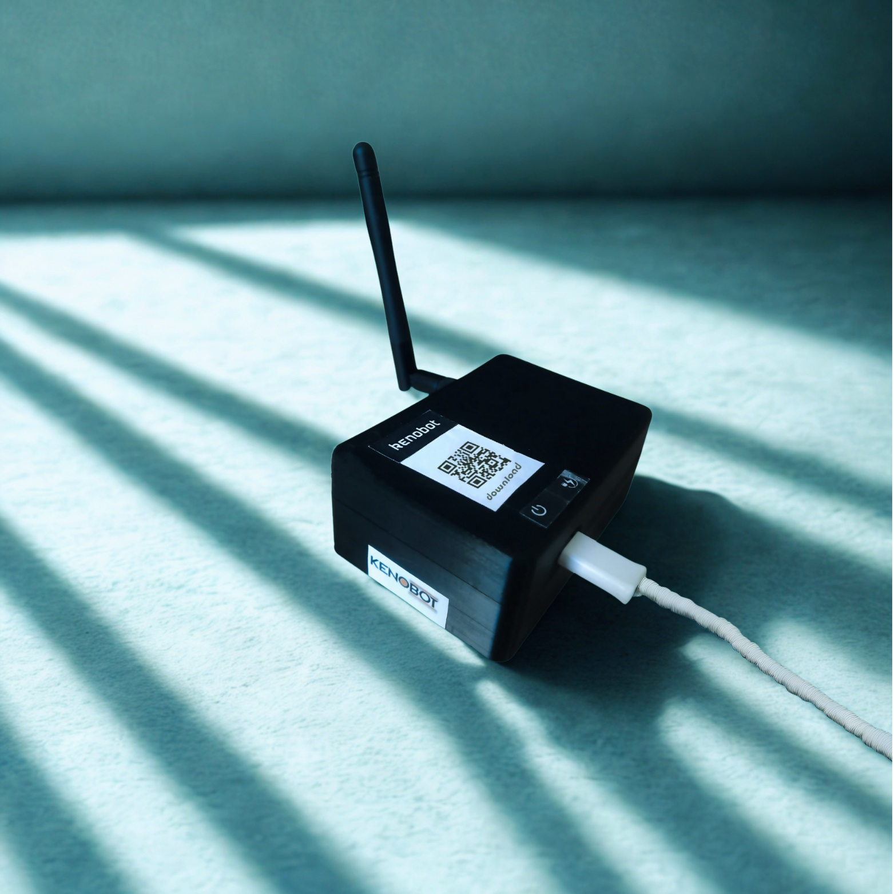
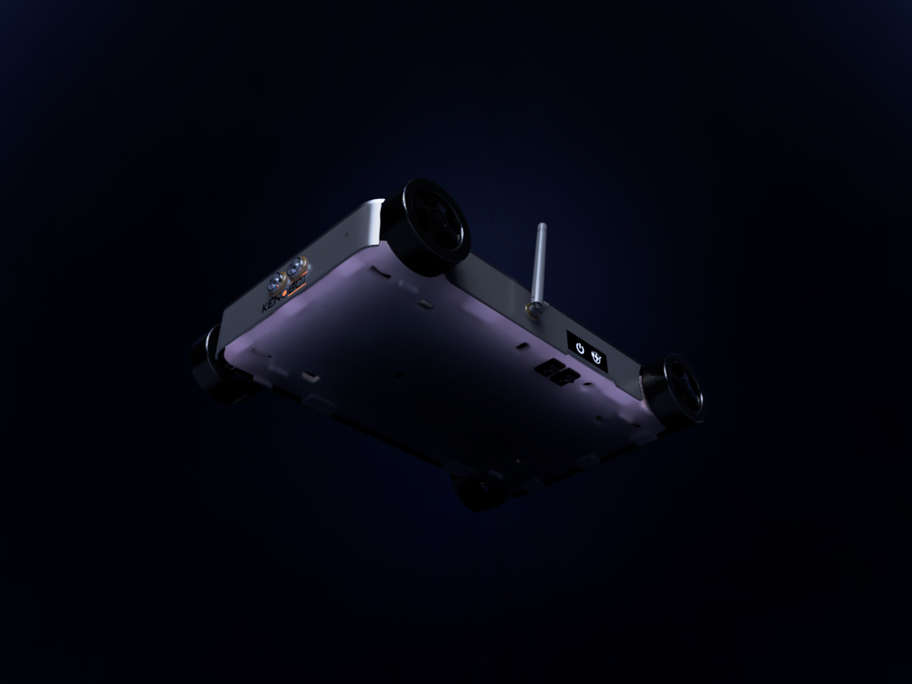

## Overview

Kenobot is an integrated robotic platform engineered as a commercial solution for autonomous navigation and robotics development. The platform's design is flexible and scalable, making it suitable for a wide range of applications, from internal logistics to advanced research.

### Dual-Layer Control Architecture

Kenobot utilizes a two-tier control architecture for high performance and reliability:

1.  **High-Level Control:** A **Raspberry Pi 5** computer processes complex sensor data, implements autonomous navigation algorithms, and manages the system.
2.  **Low-Level Control:** An **Arduino Mega** board provides precise control of motors and actuators, and reads raw data from low-level sensors, ensuring a fast and stable response.

### GPS-Denied Autonomous Navigation

A key feature of Kenobot is its ability to navigate accurately in indoor environments where GPS signals are unavailable. The platform uses advanced algorithms like SLAM (Simultaneous Localization and Mapping) with data from sensors such as LIDAR and cameras to independently determine its location and map its surroundings.

### Communication System

The platform supports a bidirectional wireless communication system for exchanging data and commands between the robot and a control station. The receiver unit connects to a computer via a USB port for monitoring and control.

### Virtual Development Features

To enable developers to test algorithms and applications safely, each platform is equipped with virtual dummy features. This virtual environment simulates various tasks and payloads without requiring physical hardware, accelerating the development cycle and reducing risks.

### Potential Applications

*   **Security and Surveillance:** Conducting autonomous patrols in designated areas.
*   **Research and Development:** A robust testbed for AI and robotics algorithms.

<video controls style="width: 100%; max-width: 800px; margin: 20px auto; display: block;">
  <source src="/hero/kenobot/kenobot.mp4" type="video/mp4">
  Your browser does not support the video tag.
</video>
