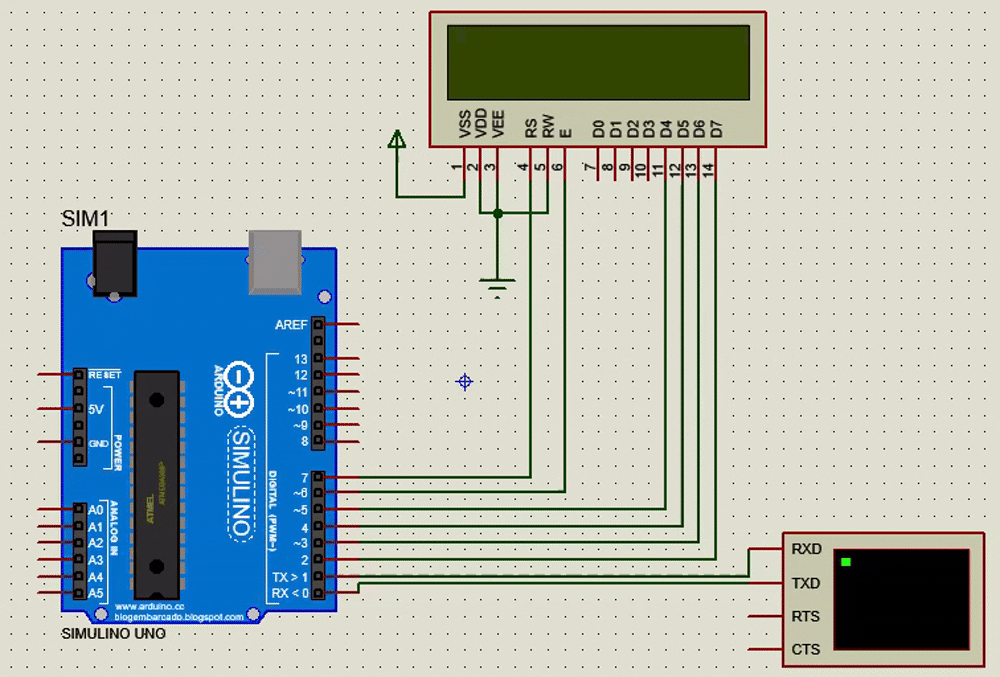

Liquid Crystal Displays (LCDs) are one of the most common electronic components in Arduino projects for displaying information and text. In this article, we will cover how to connect a 16x2 LCD with an Arduino board and program it to display a welcome message.



### Required Components

*   Arduino board (Arduino Uno or any other model).
*   16x2 LCD screen.
*   Jumper wires.
*   Breadboard for easy connection.

### Connection Diagram

### Connection Table

Here is a table detailing the connections between the LCD and the Arduino:

| LCD Pin | Connection to Arduino | Description              |
| :------ | :-------------------- | :----------------------- |
| VSS     | GND                   | Ground                   |
| VDD     | 5V                    | Power Supply             |
| VEE     | GND (or Potentiometer) | Contrast Control         |
| RS      | Pin 7                 | Register Select          |
| RW      | GND                   | Read/Write (Ground for write) |
| E       | Pin 6                 | Enable                   |
| D4      | Pin 5                 | Data Pin 4               |
| D5      | Pin 4                 | Data Pin 5               |
| D6      | Pin 3                 | Data Pin 6               |
| D7      | Pin 2                 | Data Pin 7               |
| A (Anode) | 5V (with resistor)    | Backlight Power          |
| K (Kathode)| GND                  | Backlight Ground         |

### The Code

The following code initializes the screen and displays a welcome message. You can download the code directly from the attached file.

```cpp
// Include the library for the LCD
#include <LiquidCrystal.h>

// Define the pins connected to RS, EN, D4, D5, D6, D7
const int rs = 7, en = 6, d4 = 5, d5 = 4, d6 = 3, d7 = 2;
LiquidCrystal lcd(rs, en, d4, d5, d6, d7);

void setup() {
  // Set up the serial terminal for communication with the computer
  Serial.begin(9600);
  Serial.println("setup ...");

  // Specify the dimensions of the screen (16 columns and 2 rows)
  lcd.begin(16, 2);

  // Write a message to the screen
  lcd.print("wellcome, I'm");
  
  // Call a function to print the name
  Print();
}

void loop() {
  Serial.print(".");
  
  // Temporarily turn off the screen display
  lcd.noDisplay();
  delay(500);
  
  // Turn the screen display back on
  lcd.display();
  delay(250);
}

// Function to print the name character by character
char myName[] = "Khalid Hamidi :)";
void Print() {
  Serial.print("printing ");
  Serial.print(myName);
  Serial.println("");
  
  int delayTime = 150;
  int len = sizeof(myName);
  
  for (int i = 0; i < len; i++) {
    // Set the cursor position (column i, second row)
    lcd.setCursor(i, 1);
    lcd.print(myName[i]);
    delay(delayTime);
    delayTime *= 0.88; // Gradually decrease the delay time
  }
  delay(100);
}
```

[Download Code File (PDF)](lcd.pdf)

### Code Explanation

1.  **`#include <LiquidCrystal.h>`**: Includes the necessary library to control the LCD.
2.  **`LiquidCrystal lcd(...)`**: Creates an object from the library, specifying the numbers of the connected ports.
3.  **`lcd.begin(16, 2)`**: In the `setup()` function, we initialize the screen by specifying its dimensions (16 columns and 2 rows).
4.  **`lcd.print(...)`**: This function is used to write text on the screen.
5.  **`lcd.setCursor(col, row)`**: Sets the cursor position before writing.
6.  **`lcd.noDisplay()` and `lcd.display()`**: Used to hide and show the text on the screen, creating a blinking effect in the `loop()` function.

### Video Tutorial

Here is a video that shows the practical result of the code and connection:



TODO: fix video.*

With this, we have finished explaining how to connect and program an LCD with Arduino. You can now modify the code to display the data you want in your own projects.
