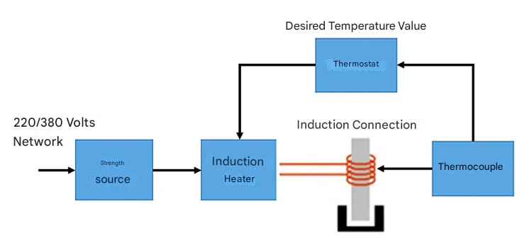
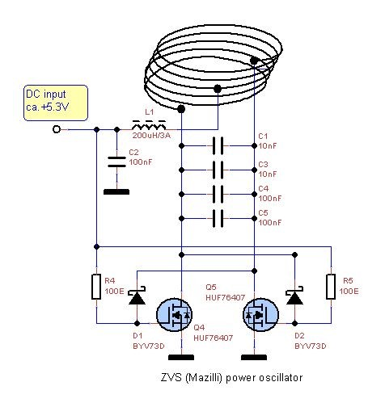
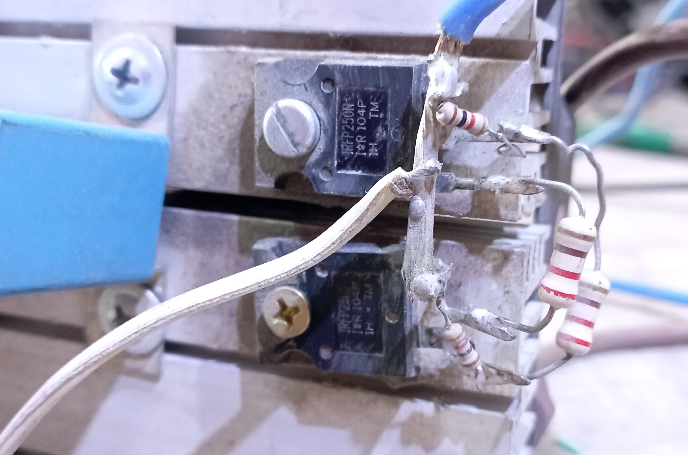
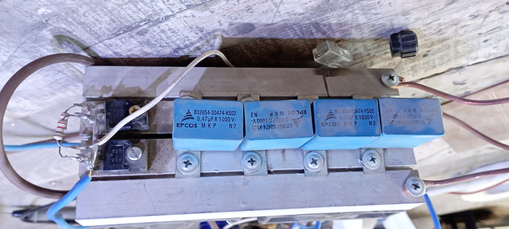
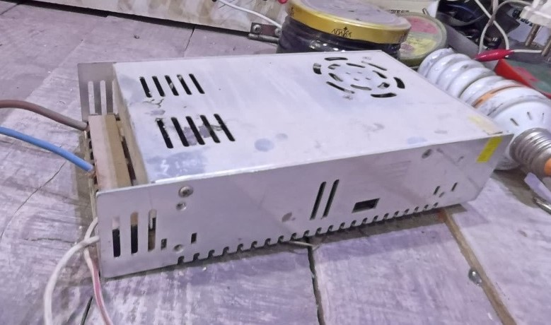
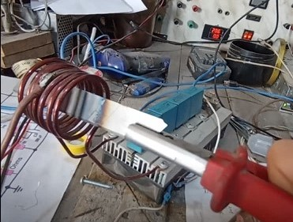
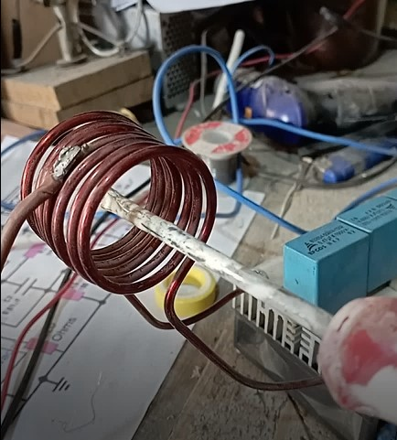
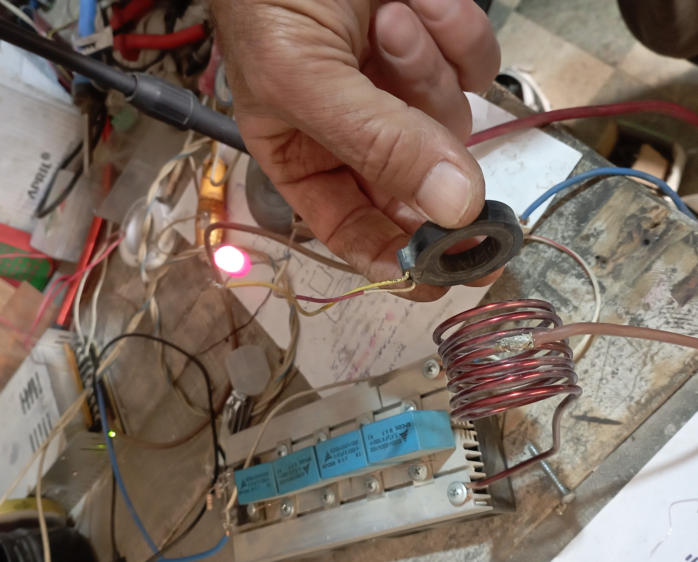

## What is Induction Heating?

Induction heating is the process of heating metals via electromagnetic induction without any direct contact. When the metal is exposed to a changing magnetic field, eddy currents are generated within it, and these currents produce heat due to the metal's resistance.
The technique is characterized by rapid heating, high efficiency, and the ability to heat only a specific part of the metal.

## How Does the System Work?

The system works by passing a high-frequency alternating current through a copper coil, which creates a changing magnetic field. When a metal piece is placed inside this field, strong currents are generated within it, raising its temperature quickly.
In homemade ZVS (Zero Voltage Switching) circuits, the frequency is generated automatically based on the values of the coil and capacitors, and it is often between **80–150 kHz**.

## Building the Circuit: Step-by-Step

The design used here is the famous **ZVS Mazilli** circuit, a simple and effective circuit that operates at low voltage (12–36V) and can drive induction coils capable of heating metals in seconds.
The circuit consists of four LC tank capacitors, a pair of high-power MOSFETs, and several resistors to start the oscillation.

### 1. Assembling the Components

#### **Transistors and Capacitors**
*   Use a suitable MOSFET such as **IRFP250N** or **HUFA76407** to handle high current.
*   Mount the MOSFETs on a heat sink with a thermal pad.
*   The capacitors should preferably be of the **MKP polypropylene** type with values of 0.33–0.47µF, connected in parallel to reduce ESR and improve resonance capability.
*   The four capacitors with the coil form an **LC Resonant Tank** circuit that determines the system's frequency.

#### **The Coil**
The coil is the most critical part of the heating circuit, and here are its ideal specifications:

*   **Wire Type:** OFC single-core copper, with an enamel coating.
*   **Wire Diameter:** Between **2.0mm – 3.0mm** to handle high current.
*   **Number of Turns:** From **8 to 12 turns**.
*   **Space Between Turns:** 1–2mm to improve cooling and reduce parasitic capacitance.
*   **Inner Coil Diameter:** 25–45mm.
*   **Wire Length:** Usually between 70–120cm.

The coil is connected directly to the resonant capacitors and the oscillating output of the circuit.

### 2. Connecting the Power Source

The circuit operates efficiently at **24V DC**, but a power supply capable of providing a high current of **10–20 amps** must be used.
The resulting power is:

\[
P = V \times I = 240–480 \text{ Watts}
\]

This power is sufficient to heat iron and steel until they glow red.

### 3. The Testing Phase

*   Place a metal piece (a magnetic material like iron) inside the coil.
*   Turn on the power source.
*   Within seconds, you will notice the temperature of the piece rising, and it may reach a full red glow.

**Important Note:**
The technique works effectively only with **Ferromagnetic** materials.
Aluminum and copper do not heat up with the same efficiency because they lack the required magnetic permeability.

## Additional Application: Wireless Charger

The same principle of induction can be used to create a simple wireless charger.
In this case, the primary coil acts as a transmitting coil, while the receiving coil consists of one or two turns connected to a rectifier and an LED.
When the receiving coil is brought near the transmitting field, energy is transferred wirelessly, and the LED lights up.

