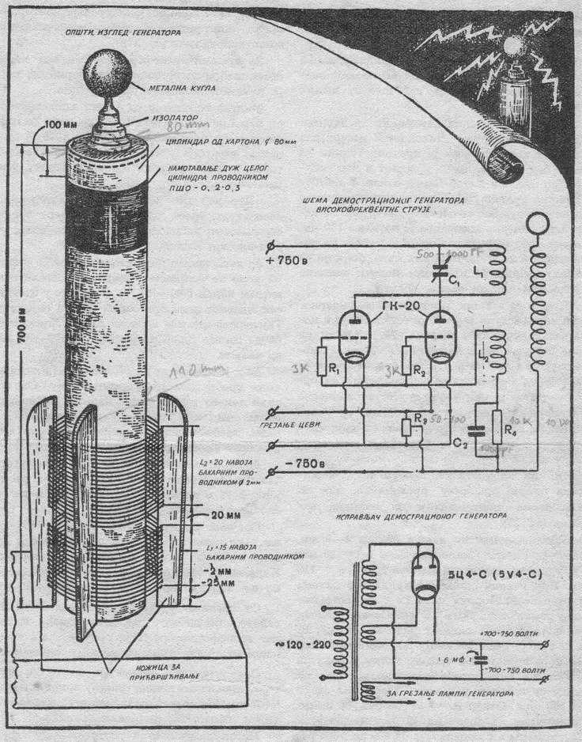
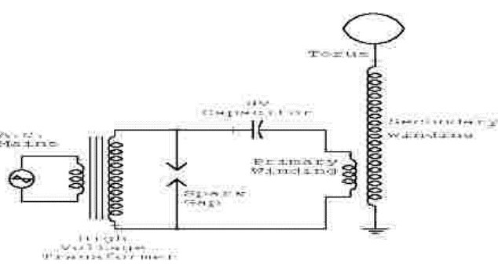
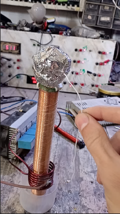
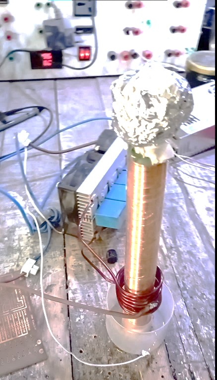

Nikola Tesla refused to let electricity remain imprisoned in wires. He envisioned energy radiating through the ether, crossing the ocean from America to Europe without a single cable, just as radio waves travel through the air without permission. For this vision, he dedicated years of his life to resonant coils, high-frequency voltages, and experiments where he tried to prove that electricity could be broadcast just like sound and light.

From the heart of these attempts, the Tesla coil was born—a resonant circuit that makes voltage leap to enormous values, turning the air itself into part of the system. In this guide, we will build a miniature, safe model of this coil to see in practice how the idea of "wireless power transfer" transforms from a dream in Tesla's mind into an experiment you can perform on your own table.

## The Physics Behind the Tesla Coil and Wireless Power Transfer

The core idea of a Tesla coil isn't the "spark" or the visual spectacle, but the creation of a high-frequency resonant system capable of storing and exchanging electromagnetic energy between its electric and magnetic fields, and then leaking a portion of this energy into the surrounding space in a way that can be captured elsewhere.

Theoretically, a Tesla coil operates as a **Resonant Transformer** consisting of:

- **Primary Circuit:** A primary coil, a capacitor, and a switching/excitation element.
- **Secondary Circuit:** A secondary coil with a high number of turns and a distributed capacitance (the top dome or toroid).

Both the primary and secondary circuits can be viewed as RLC resonant circuits with a natural frequency:

$$ f_0 = \frac{1}{2\pi\sqrt{LC}} $$

Where $L$ is the inductance of the coil, and $C$ is the equivalent capacitance of the primary capacitor or the distributed capacitance of the secondary's top load.

When both circuits are tuned to approximately the same frequency (**Resonant Coupling**), the following occurs:

1.  Energy accumulates in the magnetic field of the primary coil during the excitation phase.
2.  This energy is transferred via the intertwined magnetic field to the secondary coil (**Weakly Coupled Resonators**).
3.  In the secondary, energy alternates between a magnetic field (L) and an electric field (C) at the resonant frequency, leading to **Voltage Magnification** at the expense of current.
4.  As the voltage at the top of the secondary coil increases, the electric field strength becomes sufficient to ionize the air, creating an air discharge (Corona/Streamer) that consumes part of the energy stored in the resonant system.

What Tesla was trying to do was deeper than just generating a spark:

- In conventional systems, power is transferred via current in a metallic conductor.
- In his vision, power should be transferred primarily through the electromagnetic field itself—either through the Earth as a massive conductor or through the air/atmosphere as a medium for the field.

From a modern physics perspective, the idea of "wireless power transfer" in a Tesla coil can be summarized in two modes:

- **Near-Field Coupling:** Where the near fields (the strong magnetic field around the coil) are used to transfer energy to other nearby resonant circuits tuned to the same frequency (like a receiver coil or a nearby neon lamp). Here, a significant portion of power is transferred with reasonable efficiency over short distances—the same principle used today in **Resonant Inductive Coupling** for wireless charging.
- **Far-Field Radiation:** At certain frequencies and with special designs, a Tesla coil can radiate a portion of its energy as an electromagnetic wave into the far field, which can theoretically be received by antennas tuned to the same frequency. However, the efficiency of this mode, especially at the low frequencies Tesla aimed for to transmit power over continental distances, is practically very poor due to losses and attenuation.

In the small-scale educational model you build with 24V DC, what you will practically see is:

- A primary-secondary resonant system that raises the voltage to levels sufficient for short air discharges.
- An oscillating electromagnetic field around the secondary coil strong enough to light up fluorescent/neon bulbs at close range without wires, as a clear example of transferring energy through a field, not a wire.
- A practical demonstration of the idea that energy can "live" in the field, not just in the wire—the essence of what Tesla was trying to prove on a much larger scale.

## Building the Coil: Step-by-Step

1.  **Charging the Primary Circuit:** A 24V DC power source charges a capacitor.
2.  **Energy Discharge:** When the capacitor reaches its maximum capacity, a spark gap breaks down and discharges all the stored energy through the primary coil.
3.  **Generating Oscillations:** This rapid discharge creates high-frequency oscillations in the primary circuit.
4.  **Power Transfer:** The oscillating magnetic field transfers to the secondary coil, which has a much larger number of turns.
5.  **Voltage Amplification:** The secondary coil amplifies the voltage significantly (up to 2500V in this design), causing the energy to discharge as electrical sparks from the top capacitor (the toroid).

### 1. Winding the Secondary Coil

*   Use a thin, insulated copper wire.
*   Wind 2000 turns around a plastic insulating tube.
*   Connect the bottom end of the coil to the circuit's negative terminal and leave the top end free to connect to the top capacitor later.

### 2. Making the Top Capacitor (Toroid)

*   Prepare a paper ball and cover it completely with aluminum foil.
*   Connect the top end of the secondary coil to this ball. This will be the point from which sparks are generated.

### 3. Assembling the Circuit

*   Use an electromagnetic induction circuit as a high-frequency generator.
*   Connect the primary circuit components (power source, capacitor, spark gap, primary coil) as shown in the diagram.

### 4. Powering Up and Testing

*   After ensuring all components are connected correctly, connect the 24V DC power source to the circuit.
*   You should observe sparks generating from the top capacitor.

*Note: The resulting spark was less than expected. This could be due to non-uniform winding of the secondary coil, which affects the resonance efficiency.*

