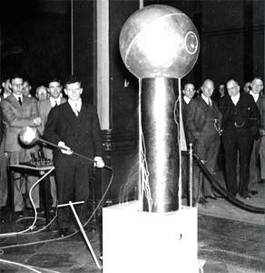
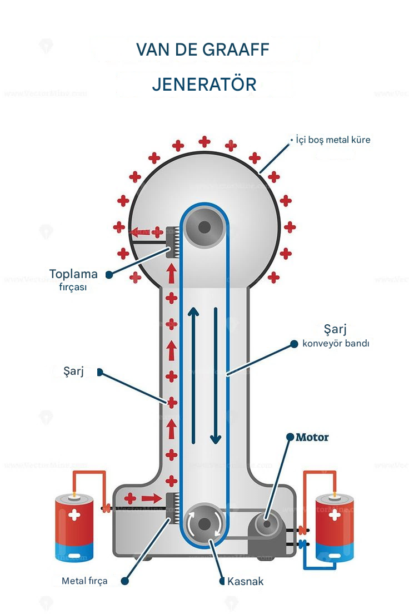
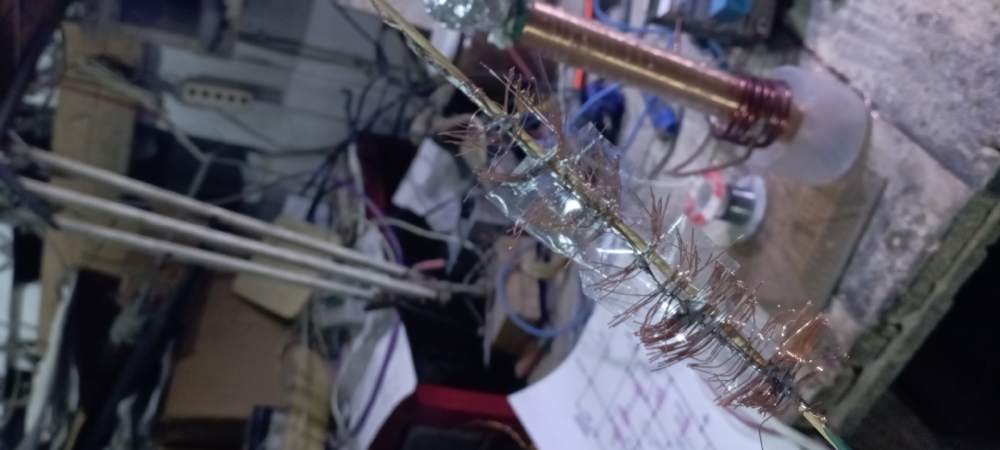
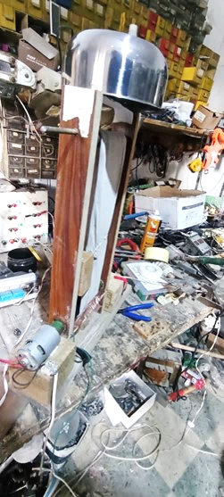

## مقدمة: شرارة الكهرباء الساكنة

هل سبق لك أن شعرت بلسعة كهربائية خفيفة ومفاجئة عند لمس مقبض باب معدني، أو رأيت شعرك يقف عند خلع سترة صوفية في يوم جاف؟ هذه الشرارة الصغيرة هي نسخة مصغرة عن قوة هائلة كامنة في الطبيعة: الكهرباء الساكنة. فماذا لو استطعنا ترويض هذه القوة وتوليدها أمام أعيننا في المختبر؟ هنا يأتي دور مولد فان دي غراف، الجهاز الذي يحول هذه الظاهرة اليومية البسيطة إلى مشهد علمي مذهل وآمن.

---

## كيف يعمل المولد؟

يعتمد فان دي غراف على نقل الشحنات الكهربائية من نقطة سفلية إلى القبة المعدنية العلوية بواسطة حزام من مادة عازلة.

### المبدأ:

1. **مصدر الجهد السفلي** يشحن الأمشاط السفلية.
2. **المشط السفلي** ينقل الشحنة إلى سطح الحزام العازل.
3. **الحزام المتحرك** يرتفع بالشحنات نحو الأعلى.
4. **المشط العلوي** يسحب الشحنة من الحزام.
5. **القبة المعدنية** تتراكم عليها الشحنات حتى تصل إلى جهد مرتفع جداً.

---

## بناء المولد: خطوة بخطوة

تم بناء هذا النموذج باستخدام مواد متوفرة في المختبر وبأقل تكلفة ممكنة.

---

### 1. بناء الهيكل الخشبي

تم تجهيز هيكل خشبي بسيط لتثبيت المحرك، البكرات، والحزام.

.jpg)
.jpg)

المحرك المستخدم هنا هو محرك DC من نوع **Johnson 70312**، وهو محرك قوي يُستخدم عادة في الأدوات الكهربائية ويعمل بكفاءة على 12 فولت. يتمتع بعزم جيد كاف لتدوير بكرة الحزام بسرعة ثابتة.

.jpg)

بعد ذلك تم تركيب البكرات العلوية والسفلية بشكل متوازٍ ومحكم.

.jpg)
.jpg)

---

### 2. تجهيز الأمشاط النحاسية

الأمشاط هي الجزء الأكثر حساسية في مولد فان دي غراف. وظيفتها نقل الشحنات من وإلى الحزام.

لتجهيزها، تم استخراج شعيرات نحاسية دقيقة من سلك كهربائي متعدد الشعرات، ثم تثبيتها على قضيب خشبي لتشكيل مشط شاحن وآخر مجمّع.

.jpg)
.jpg)
.jpg)

المشط يجب أن يقترب من الحزام لمسافة **1–3 مم** دون أن يلمسه، فالمسافة الدقيقة هي ما يحدد نجاح عملية الشحن عبر الانبعاث الحدي (Corona Discharge).

---

### 3. التجميع النهائي

بعد تجهيز الهيكل، البكرات، الأمشاط، والمحرك، تم دمجها بالكامل وتوصيل المحرك بمصدر 12 فولت.

---

## النتائج والدروس المستفادة

بعد توصيل المولد بالطاقة، دار الحزام بشكل جيد، لكن الجهاز لم يتمكن من توليد كهرباء ساكنة.

### **لماذا لم يعمل؟ الأسباب الفنية المحتملة**

#### 1. **مواد الحزام والبكرات**
تأثير الشحن يعتمد على السلسلة التريبولكتريك (Triboelectric Series).  
إذا كانت مادة الحزام غير مناسبة، فلن يحدث انتقال فعلي للشحنات.

#### 2. **تصميم الأمشاط**
إذا كانت الشعيرات بعيدة جداً أو قريبة أكثر من اللازم، يتوقف انتقال الشحنات.  
كما أن أي توصيل غير محكم سيؤدي إلى تسرب كامل للشحنة.

#### 3. **الرطوبة العالية**
الرطوبة عدو مباشر للكهرباء الساكنة. الهواء الرطب يسرّب الشحنة قبل تراكمها.

#### 4. **تسريب الشحنة من الهيكل**
وجود زوايا حادة أو مسامير مكشوفة قرب القبة يؤدي لتسرب الشحنة فوراً عبر التفريغ الجزئي.

#### 5. **عدم وجود قبة معدنية مثالية**
يجب أن تكون القبة:
- ملساء جداً  
- بدون حواف  
- بدون ثقوب  
- ومصنوعة من معدن رقيق جيد التوصيل

---

## خلاصة التجربة

على الرغم من أن الجهاز لم ينجح في توليد الشحنة، إلا أن التجربة وفرت:

- فهماً عملياً لآلية عمل مولدات الكهرباء الساكنة  
- خبرة في تصميم الأمشاط والبكرات  
- معرفة بالمشاكل الفعلية التي تواجه الأجهزة الكهربائية التعليمية  
- إمكانية تطوير النموذج في النسخة القادمة عبر تحسين المواد والهيكل

هذه التجارب هي الأساس الحقيقي للتعلم الهندسي الفعلي.

اخبروني إن نجح معكم.