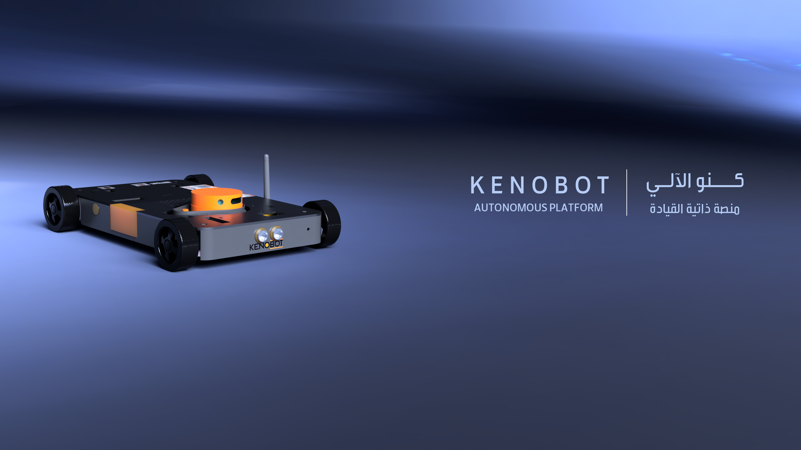
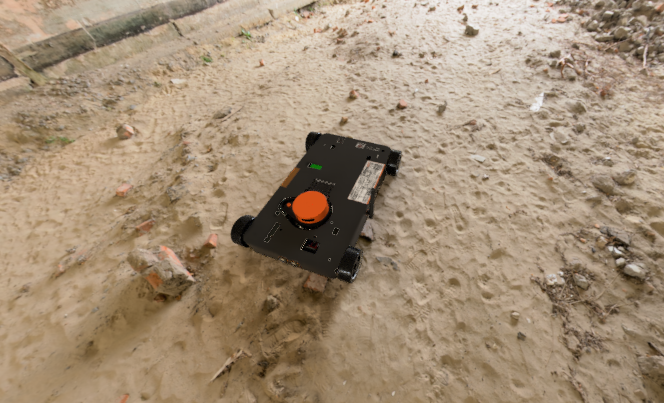

## نظرة عامة

Kenobot منصة روبوتية متكاملة ومصممة كحل تجاري للملاحة الذاتية وتطوير الروبوتات. تصميم المنصة مرن وقابل للتطوير، مما يجعلها مناسبة لمجموعة واسعة من التطبيقات، من الخدمات اللوجستية الداخلية إلى الأبحاث المتقدمة.

### بنية التحكم المزدوجة

تعتمد Kenobot على بنية تحكم من طبقتين لتحقيق الأداء العالي والموثوقية:

1.  **الطبقة العليا (High-Level Control):** تستخدم حاسوب **Raspberry Pi 5** لمعالجة بيانات الحساسات المعقدة، وتطبيق خوارزميات الملاحة الذاتية، وإدارة النظام.
2.  **الطبقة المنخفضة (Low-Level Control):** تعتمد على لوحة **Arduino Mega** للتحكم الدقيق في المحركات والمشغلات، وقراءة البيانات الأولية من المستشعرات منخفضة المستوى، مما يضمن استجابة سريعة ومستقرة.

### الملاحة الذاتية بدون GPS

من أبرز ميزات Kenobot قدرتها على الملاحة بدقة في البيئات المغلقة التي لا تتوفر فيها إشارة GPS. تعتمد المنصة على خوارزميات متقدمة مثل SLAM (التموضع ورسم الخرائط في ان واحد) باستخدام بيانات من حساسات مثل LIDAR والكاميرات لتحديد موقعها ورسم خريطة للبيئة المحيطة بشكل مستقل.

### نظام الاتصالات

تدعم المنصة نظام اتصالات لاسلكي ثنائي الاتجاه لتبادل البيانات والأوامر بين الروبوت ومحطة التحكم. يتم توصيل جهاز الاستقبال بالحاسوب عبر منفذ USB للمراقبة والتحكم.

### ميزات التطوير الافتراضية

لتمكين المطورين من اختبار وتجربة الخوارزميات والتطبيقات بامان، تم تزويد كل منصة بميزات افتراضية وهمية. هذه البيئة الافتراضية تحاكي مهام وحمولات مختلفة دون الحاجة لوجودها الفعلي، مما يسرع دورة التطوير ويقلل المخاطر.

### تطبيقات محتملة

*   **الامن والمراقبة:** القيام بدوريات ذاتية في المناطق المحددة.
*   **الأبحاث والتطوير:** منصة اختبار قوية لخوارزميات الذكاء الاصطناعي والروبوتات.
