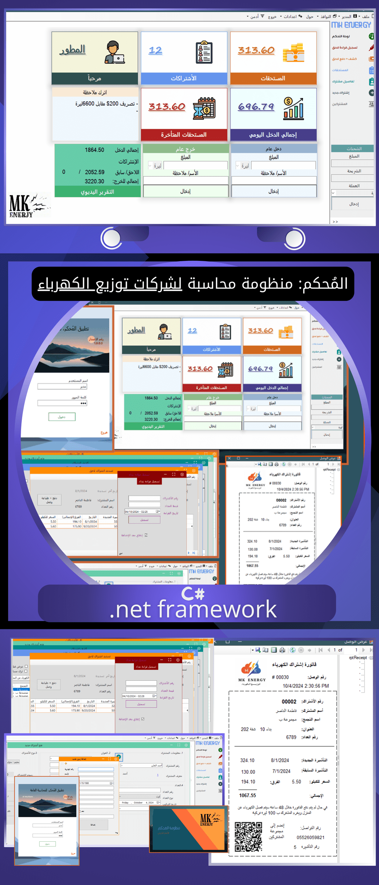

## Overview

MK Energy is a comprehensive management software built to handle the operational complexities of electricity distribution companies. Developed in C# and powered by a high-capacity, high-speed MS SQL Server database, the system provides a robust solution for subscriber and employee management.

## Key Features

- **Subscriber Management**: The system supports both **prepaid** and **postpaid** subscriber models, offering flexibility in billing and customer service.
- **High-Performance Database**: Utilizes MS SQL Server to ensure fast, reliable, and scalable data management for a large number of subscribers.
- **Employee Administration**: Includes modules for managing employee records, roles, and permissions within the system.
- **Billing and Invoicing**: Streamlines the process of generating bills and tracking payments for all subscriber types.
- **Reporting**: Provides detailed reports on consumption, payments, and subscriber activity to support business decisions.

