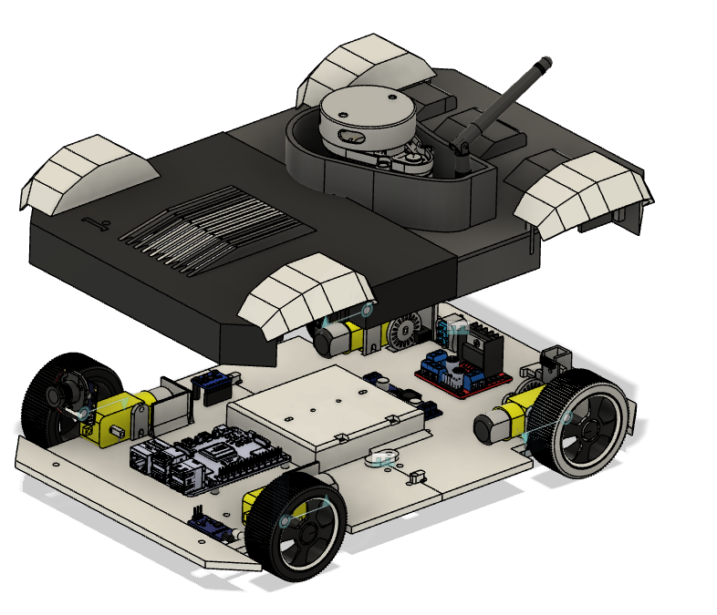
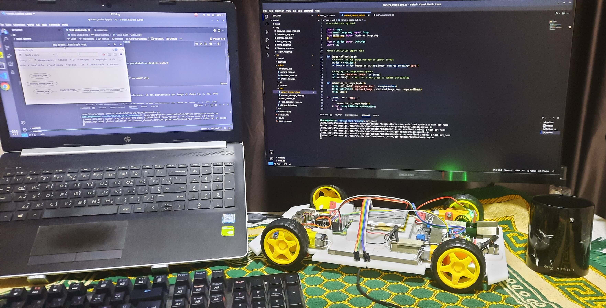
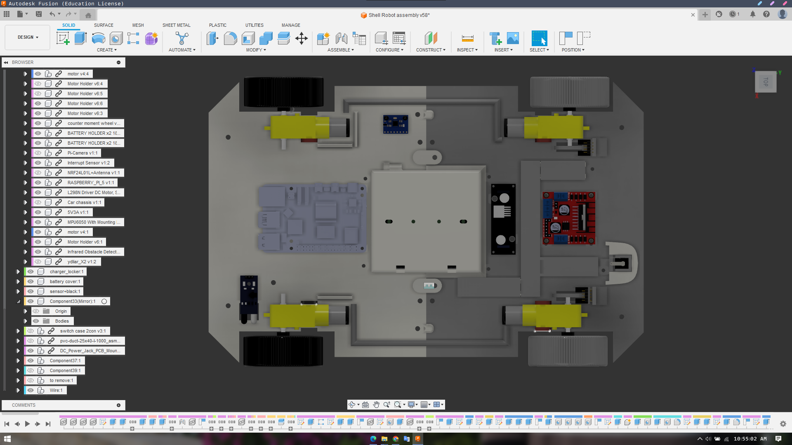
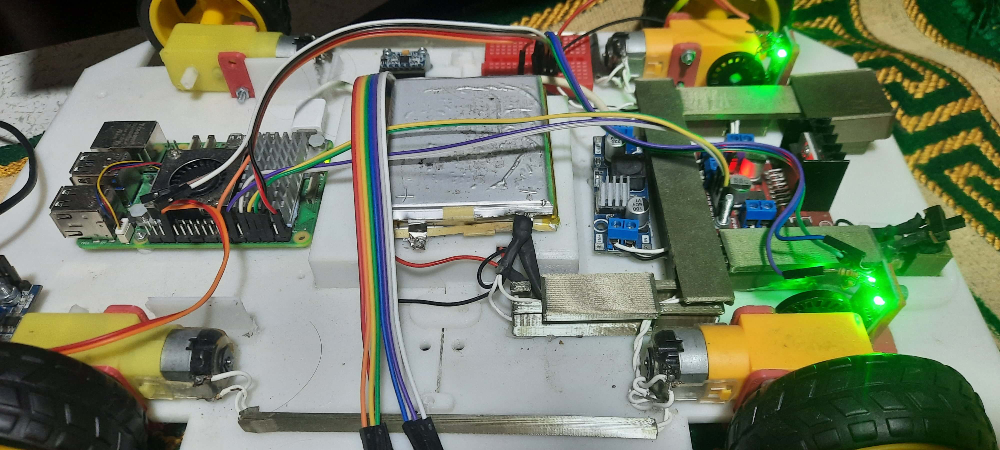
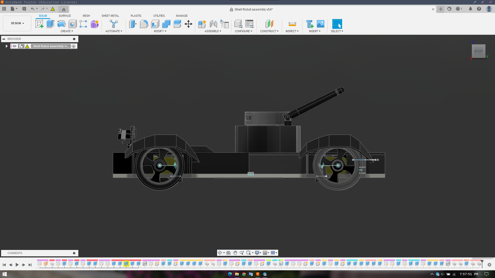

## نظرة عامة على المشروع

يركز هذا البحث على تصميم وتحسين أنظمة التحكم الطولي للمركبات ذاتية القيادة (AVs). يتمحور جوهر الدراسة حول تطبيق **وحدات التحكم بالمنطق الضبابي (FLC)** ودمجها مع **وحدات التحكم PID** التقليدية لإنشاء أنظمة تحكم هجينة ومتقدمة.

الهدف الأساسي هو تعزيز سلامة وموثوقية وكفاءة المركبات المستقلة. من خلال تطوير وحدات تحكم قادرة على إدارة الطبيعة الديناميكية والمعقدة لبيئات القيادة في العالم الحقيقي، يهدف هذا المشروع إلى تحسين زمن استجابة السيارة واستقرارها.

## الأهداف والأساليب الرئيسية

- **التحكم بالمنطق الضبابي**: يستكشف استخدام المنطق الضبابي للتعامل مع الغموض والشكوك الكامنة في التحكم الطولي للمركبة (على سبيل المثال، التسارع، والكبح، والحفاظ على مسافات آمنة).
- **نظام FLC-PID الهجين**: يتضمن جزء كبير من البحث تصميم واختبار نظام هجين يجمع بين نقاط القوة التكيفية للمنطق الضبابي واستقرار التحكم PID.
- **تطوير نموذج أولي**: يشمل المشروع تصميم نموذج أولي لمركبة مستقلة لتكون بمثابة منصة اختبار لخوارزميات التحكم المطورة.
- **تحليل الأداء**: أظهر تنفيذ واختبار أنظمة التحكم تحسينات كبيرة في استجابة النظام واستقراره، مما يؤكد إمكانية التطبيق في العالم الحقيقي.

   