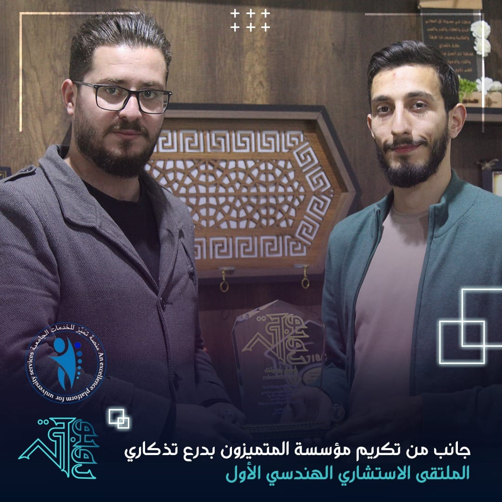

The "First Engineering Advisory Forum" was successfully held on Thursday, November 7th, in the city of Azaz, organized in collaboration with the Tamayuz platform for university services. The event saw enthusiastic participation from students, who were eager to engage in the discussions.

Overseen by Eng. Khaled Hamidi, the forum benefited from his extensive experience, enriching the dialogue on the role and future of mechatronics engineering in the region. The generous support of the Al-Mutamayizun Educational Foundation was instrumental in the event's success.

Discussions focused on how mechatronics can drive innovative, practical projects, with several successful past examples showcased to inspire attendees. The forum also provided valuable guidance on promising future engineering specializations such as renewable energy, artificial intelligence, and robotics, aligning them with local market needs.

A key highlight was the presentation of six student projects, spanning robotics, renewable energy, and software. These projects underwent detailed evaluation, offering students a valuable opportunity to present their ideas and receive constructive feedback.

In a heartfelt moment, the Al-Mutamayizun Educational Foundation was honored with a commemorative shield in recognition of their significant contribution to the forum's success.

<iframe src="https://www.facebook.com/plugins/post.php?href=https%3A%2F%2Fwww.facebook.com%2Fengkhamidi%2Fposts%2Fpfbid02VowEnVgypkGPhQavqs15AJJNo21gjCHmRfUaAQPExSVjDEQsM62TYusy4qgbjxETl&show_text=true&width=500" width="500" height="755" style="border:none;overflow:hidden" scrolling="no" frameborder="0" allowfullscreen="true" allow="autoplay; clipboard-write; encrypted-media; picture-in-picture; web-share"></iframe>

