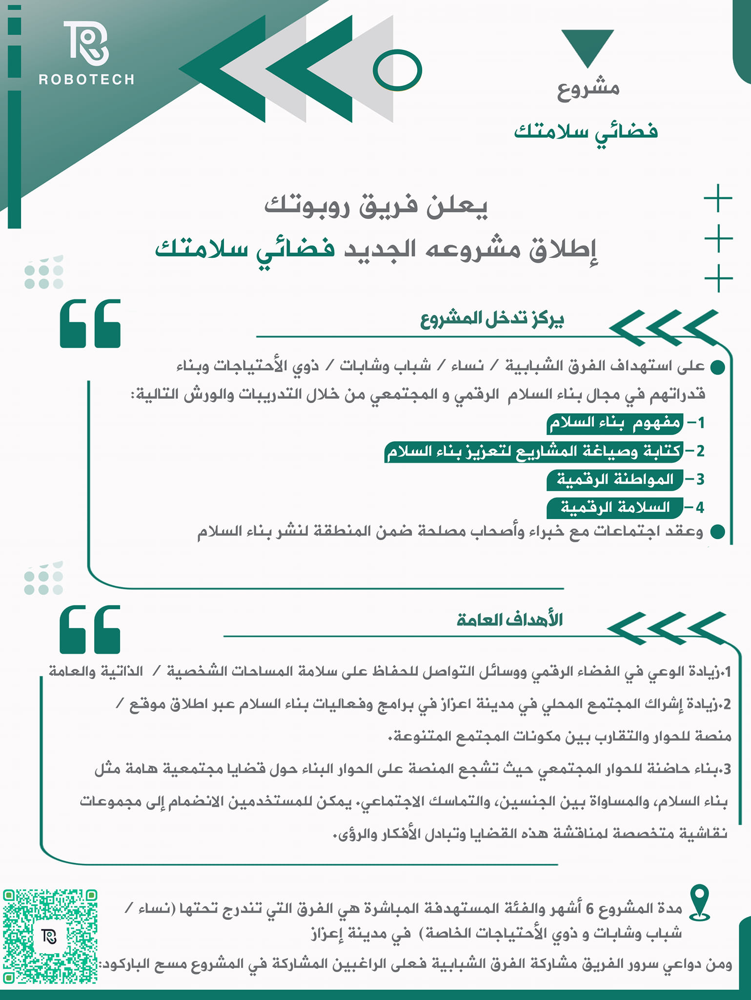

تم بحمد الله إطلاق أولى فعاليات مشروع **"فضائي سلامتك"** الذي سعينا إليه طويلاً، ليواكب الاحتياجات الراهنة. كم هو جميلٌ أن نرى رؤيتنا وقد غدت واقعًا يزرع الأمل ويُتيح أدوات التغيير على الأرض وفي الفضاء الرقمي.

بالشراكة مع منظمة **بيتنا (Baytna)**، أطلق فريق روبوتك أولى ورشاتنا ضمن المشروع، حيث بدأنا بتدريب مميز حول **"مفهوم بناء السلام"**، بمشاركة فعالة من فرق شبابية ونسائية وأشخاص معنيين من ذوي الإعاقة في مدينة إعزاز.

كما شارك في الورشة 16 جهة من الفرق التطوعية ومنظمات المجتمع المدني، مما أغنى النقاشات ووسّع آفاق التعاون.

نؤمن أن بناء السلام يبدأ من فهم عميق للمفاهيم، وتمكين الأفراد ليكونوا صانعي تغيير في مجتمعاتهم، سواء على الأرض أو في الفضاء الرقمي.

<iframe src="https://www.facebook.com/plugins/post.php?href=https%3A%2F%2Fwww.facebook.com%2Far.robotech%2Fposts%2Fpfbid0pAWwqKkD1AF59E7Uku2w4hGAaNV3FxDMGbvo3cwuZzK6fW1gKDLqVq68bBbZNrtfl&show_text=true&width=500" width="500" height="756" style="border:none;overflow:hidden" scrolling="no" frameborder="0" allowfullscreen="true" allow="autoplay; clipboard-write; encrypted-media; picture-in-picture; web-share"></iframe>
