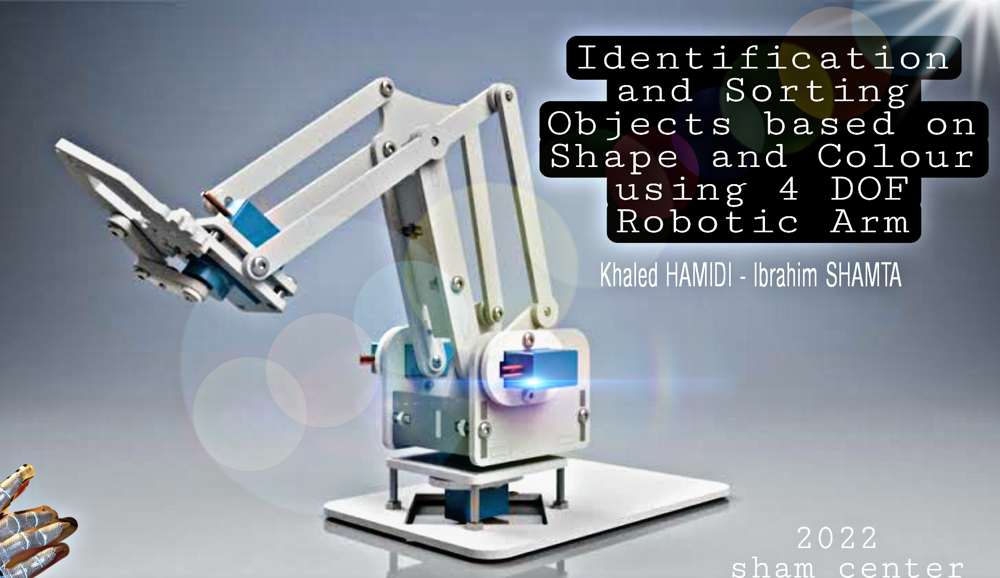

---
title: "تصنيف وفرز الأشكال لونيا باستخدام ذراع روبوتية بأربع درجات حرية"
summary: مقاربة ذكية للفرز والمعاينة اللحظية للأجسام المتدفقة باستخدام المعالجة الصورية ونظام ميكاتروني لفرز الألوان
date: 2023-07-26
draft: false
reading_time: true
commentable: false
pager: true
show_date_updated: false
show_related: true
categories:
  - "هندسة وروبوتات"
  - "أكاديمي وبحثي"
tags:
  - ميكاترونكس
  - أتمتة
  - بحث علمي
---

تُشكل عمليات فرز وتصنيف المنتجات تحدي كبير، خصوصا في البيئات غير الصحية، حيث يكون الاعتماد على العنصر البشري عرضة للأخطاء.  
ومن هذا المنطلق، يعرض هذا البحث حلا ذكيا يعتمد على ذراع روبوتية ذات أربع درجات حرية، للتحكم في عملية فرز الأشكال بناء على ألوانها، باستخدام تقنيات المعالجة الصورية.

تم استخدام وحدة Raspberry Pi للتحكم بالذراع، حيث تقوم خوارزميات الرؤية الحاسوبية بتحليل لون الجسم المراد تصنيفه، ومن ثم إصدار الأوامر اللازمة للذراع لالتقاط الجسم ووضعه في المكان المخصص وفقا للونه.

## بيانات النشر

- **الجهة الناشرة:** مركز الشام للدراسات والأبحاث  
- **تاريخ النشر:** 26 تموز 2023  

## رابط البحث

[الاطلاع على المقال في موقع مركز الشام للدراسات](https://shamuniversity.com/sham-center-list/articles/8)
 
## تحميل
[تحميل المستند الكامل (PDF)](4dof-robotic-arm.pdf)
 

