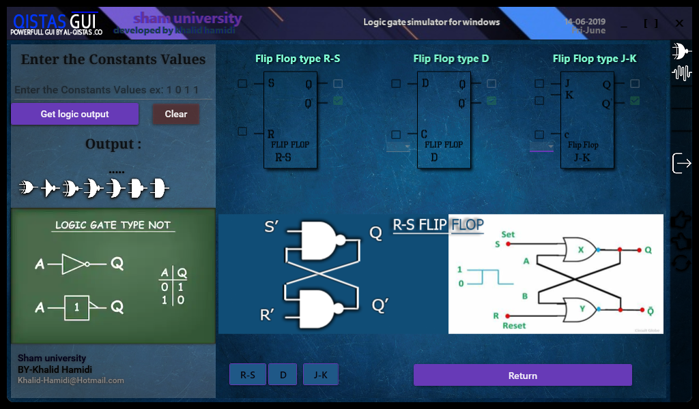

# مستكشف العناصر المنطقية
_محاكي البوابات المنطقية_
مستكشف العناصر المنطقية هو تطبيق يسمح لك بمحاكاة البوابات المنطقية، والقلابات، وفك التشفير، والتشفير، ومضاعفات الإرسال، ومزيلات تعدد الإرسال، ومقارنة إشارتين. يوفر واجهة سهلة الاستخدام لاستكشاف وفهم مختلف العناصر المنطقية.

