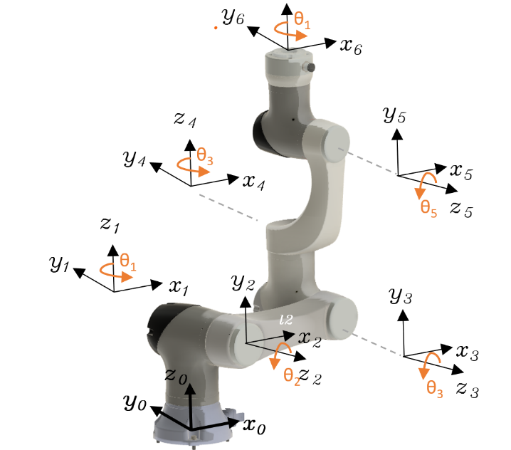
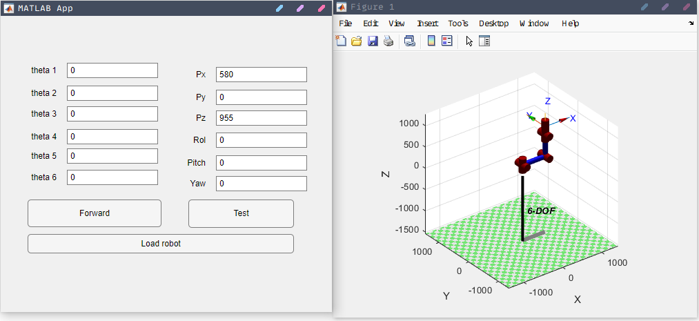
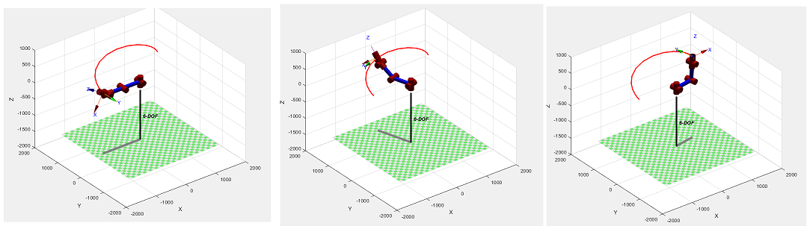

## Introduction
This study focuses on the Elfin E15, a 6-DOF industrial robot from Han's Robot, composed of six revolute joints. The analysis employs the Denavit-Hartenberg (D-H) parameters to model the robot's kinematics.

### D-H Parameters
The D-H parameter table is crucial for defining the robot's structure, including link lengths and joint orientations.

**Table 1: Elfin E15 Robot Arm Link Coordinate Parameters**
| Link | α_(i-1) | a_(i-1) | d_i | θ_i | Joint Variable |
|------|---------|---------|-----|-------|----------------|
| 1    | 0       | 0       | h_1 | θ_1   | θ_1            |
| 2    | 90      | 0       | 0   | θ_2   | θ_2            |
| 3    | 0       | a_2     | 0   | θ_3   | θ_3            |
| 4    | -90     | 0       | d_4 | θ_4   | θ_4            |
| 5    | +90     | 0       | 0   | θ_5   | θ_5            |
| 6    | -90     | 0       | d_6 | θ_6   | θ_6            |

**Table 2: Link Lengths (mm)**
| Link | Length |
|------|--------|
| h_1  | 262    |
| a_2  | 580    |
| d_4  | 520    |
| d_6  | 173    |

## Forward Kinematics Analysis
Forward kinematics determines the end effector's position and orientation from given joint angles. This is achieved by computing transformation matrices between adjacent joint frames.

### MATLAB Simulation
A MATLAB App Designer application was developed to simulate the robot's motion. The `robot_fkine` function calculates the cumulative transformation matrices and visualizes the robot in a 3D plot.

## Inverse Kinematics Analysis
Inverse kinematics calculates the required joint angles to achieve a desired end effector position and orientation. This is a more complex problem, often with multiple solutions.

## Motion Simulation
The robot's trajectory is planned by interpolating between initial and final joint configurations. Forward kinematics is used to calculate the end effector's path, which is then animated.

## Download
[Download the full document (PDF)](kinematics-analysis-6r-robot.pdf)
