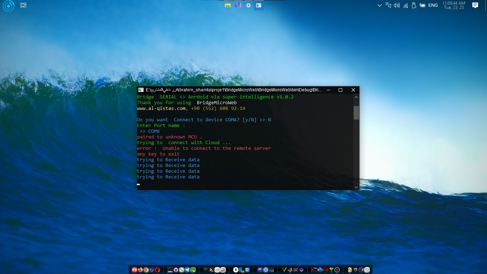
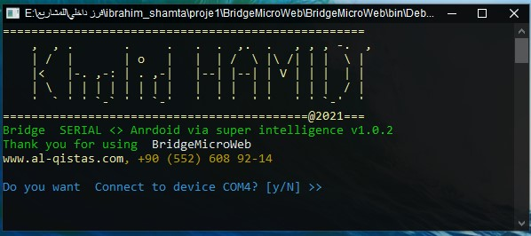

The perfect solution for your IoT projects
View, monitor and control Over Internet for any project type that includes the serial port.
It is a system that allows control of embedded devices or development centers via the Internet



- **Virtual terminal**: A virtual terminal that allows you to send and receive commands from the controller
- **Easy** :Easy to configure and go
- **Sensors plot** : Diagrams and diagrams of the readings from the sensors

### development

- PHP for web API
- C# Console Application for link server.
- Serial protocol to connect any device that support RS232.

### Website link

the project website here  [link](https://khaledhamidi.github.io/superIntelligence/).
Development by [Khaled HAMIDI](engkhamidi@gmail.com)


