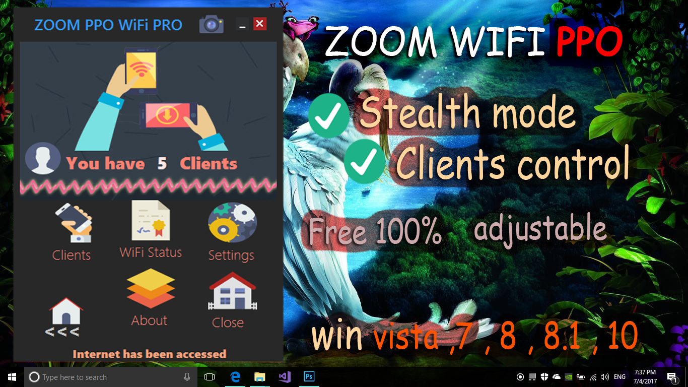
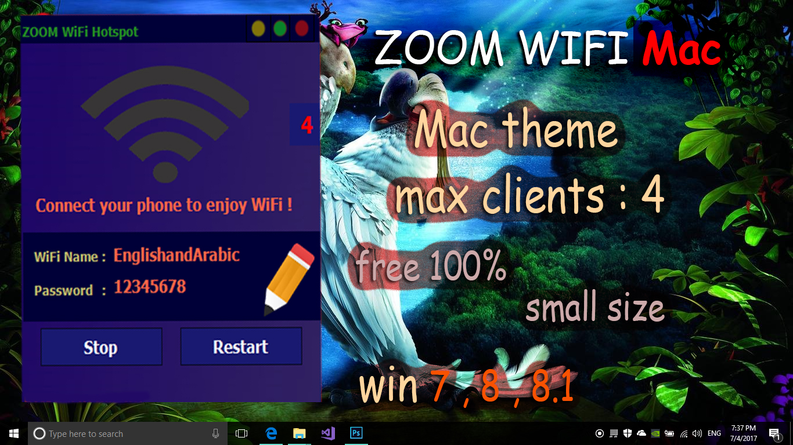

## Overview

In response to widespread internet disruptions during the Syrian conflict, I developed ZOOM WIFI Hotspot, a lightweight desktop application that transforms a computer into a wireless access point. This utility was engineered to provide a stable, low-resource solution for sharing internet connectivity with nearby mobile devices, addressing a critical need for communication in underserved areas.

## From Concept to Impact

The project originated from a direct need to overcome the limitations of intermittent and inaccessible internet services. The development process involved a deep dive into network protocols and Windows API functionalities, utilizing C# and the WMI interface to create an intuitive graphical user interface. The initial release enabled users to broadcast any available internet connection as a Wi-Fi network with a single click.

> "The primary challenge was ensuring robust stability while minimizing resource consumption, making it accessible even on low-spec hardware."

## Key Features

- **Universal Compatibility:** Supported all major Windows versions, including XP, 7, 8, 8.1, and 10.
- **Cost-Free Access:** The application was distributed as freeware to ensure accessibility for all.
- **Efficient Design:** Engineered for minimal performance impact, allowing it to run seamlessly on older hardware.
- **Bilingual Interface:** Offered in both Arabic and English to serve a broader user base.

## Community Adoption and Influence

Within its first year, ZOOM WIFprojects/zoom-wifi-hotspot/I Hotspot surpassed 3,000 downloads, becoming a vital tool in besieged regions where it enabled shared, low-cost internet access. The success of the application prompted a proposal to the Microsoft developer community, which contributed to the integration of the "Mobile Hotspot" feature in Windows 10, version 1703.

## Gallery

## Legacy and Lessons Learned

The development of ZOOM WIFI Hotspot underscored a core principle: **innovation is often born from necessity.** This project not inly provided a practical solution to a pressing problem but also demonstrated the power of community-driven software development.
